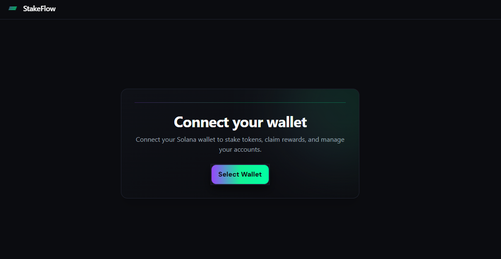
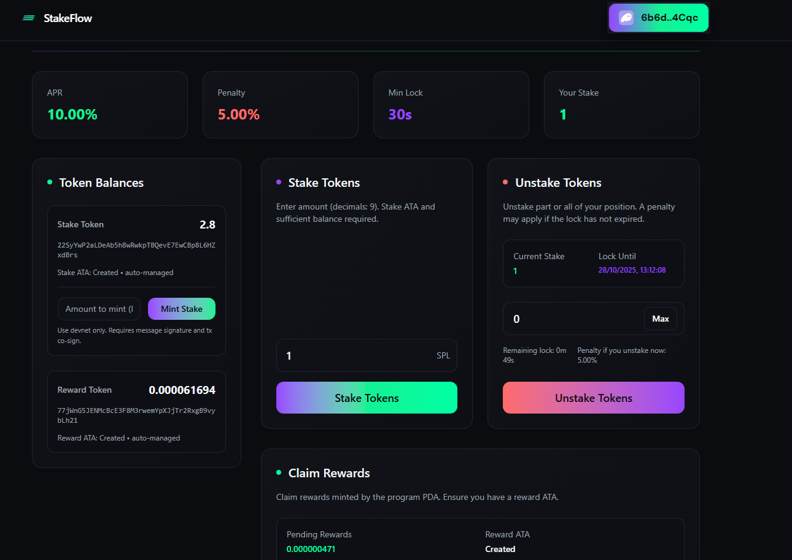
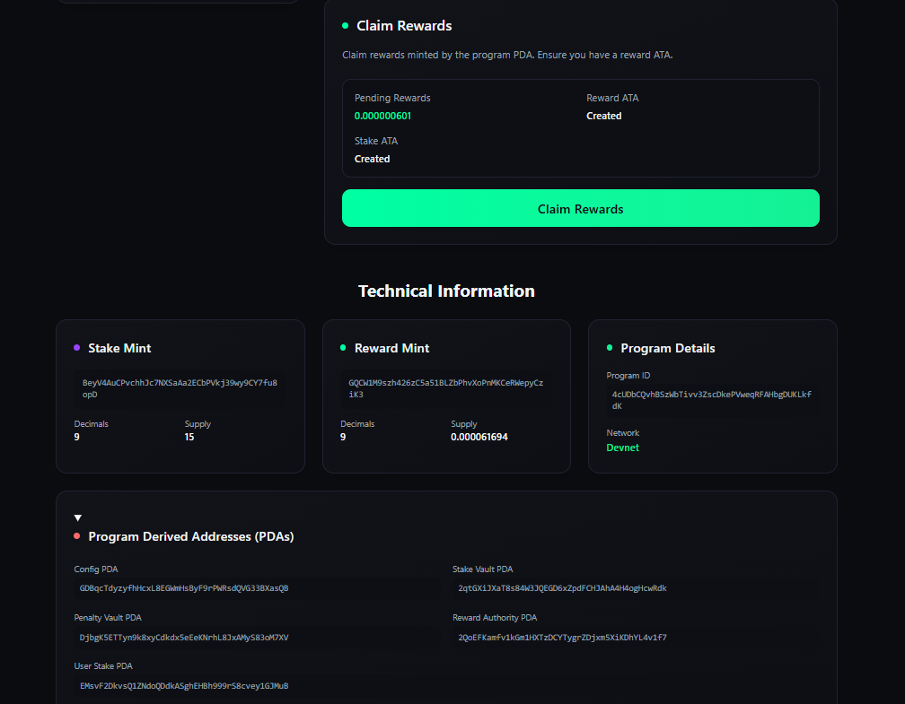

# StakeFlow

Live: https://stakeflow.casaislabs.com/

Solana staking dApp built with Anchor and React. The project consists of:
- Backend (on-chain program): [stake-flow README](stake-flow/README.md)
- Frontend (React + Vite): [stakeflow-frontend README](stakeflow-frontend/README.md)

This README consolidates backend and frontend docs, provides quick setup, and links to detailed docs in each part.

## Table of Contents
- [Overview](#overview)
- [Flow Overview](#flow-overview)
- [Images](#images)
- [Tech Stack](#tech-stack)
- [Requirements](#requirements)
- [Quick Devnet Setup](#quick-devnet-setup)
- [Backend (stake-flow)](#backend-stake-flow)
- [Frontend (stakeflow-frontend)](#frontend-stakeflow-frontend)
- [Environment & Variables](#environment--variables)
- [Development & Scripts](#development--scripts)
- [Testing & Verification](#testing--verification)
- [Deployment](#deployment)
- [Security & Production Hardening](#security--production-hardening)
- [Troubleshooting](#troubleshooting)
- [Quick Links](#quick-links)

## Overview
- Anchor-based SPL token staking dApp on Solana.
- Users stake a token, accrue rewards, and claim them later.
- Program manages PDAs for config, vaults, and the reward mint authority.
- Frontend provides a streamlined UX for stake/unstake/claim with dev tools.

## Flow Overview

```mermaid
graph TD;
  U[User Wallet (Phantom/Solflare)] --> F[Frontend (React + Wallet Adapter)];
  F --> P[Anchor Program (stake-flow)];
  P --> D[PDAs: config, stake_vault, penalty_vault, reward_mint_authority];

  subgraph Staking
    F -->|stake(amount)| P;
    P -->|transfer stake to vault| SV[Stake Vault (SPL Token Account)];
    P -->|record position| USP[User Stake PDA];
  end

  subgraph Rewards
    P -->|accrue over time (APR)| USP;
    F -->|claim| P;
    P -->|mint reward to user| UR[User Reward ATA];
  end

  subgraph Unstake
    F -->|unstake| P;
    P -->|apply lock/penalty policy| USP;
    P -->|transfer back stake| US[User Stake ATA];
  end

  subgraph Events
    W[Wallet Provider Events] --> L[Frontend listeners];
    L --> R[Refresh balances & PDAs];
  end
```

## Images







## Tech Stack
- Solana: `solana-cli`, `spl-token`, Anchor (0.29+).
- On-chain: Rust (program), Anchor IDL/types.
- Frontend: React, Vite, TypeScript, Solana Wallet Adapter.
- Tooling: ESLint, `ts-node`, serverless API (Vite SSR loader for dev).

## Requirements
- Solana CLI 1.18+ and `spl-token`.
- Anchor 0.29+.
- Node.js 18+ and npm 9+.
- `ts-node` installed (dev).

## Quick Devnet Setup
1) Configure devnet:
- `solana config set -u devnet`
- `solana airdrop 2`, then `solana balance` to confirm.

2) Create SPL mints (9 decimals):
- `spl-token create-token --decimals 9` (stake)
- `spl-token create-token --decimals 9` (reward)

3) Create ATAs on devnet:
- `spl-token create-account <STAKE_MINT> --url https://api.devnet.solana.com`
- `spl-token create-account <REWARD_MINT> --url https://api.devnet.solana.com`

4) Initialize PDAs and config (backend):
- From `stake-flow/`: `anchor run init`
- Verify with `anchor run token-info`

5) Configure frontend:
- Update addresses in `stakeflow-frontend/src/config.ts`
- Optional local mint endpoint: configure `.env` (see below)

6) Run frontend:
- From `stakeflow-frontend/`: `npm install && npm run dev`

## Backend (stake-flow)
- Code and scripts in `stake-flow/` — see `stake-flow/README.md` for full details.
- Highlights:
  - PDAs: `config`, `stake_vault`, `penalty_vault`, `reward_mint_authority`.
  - `anchor run init`: migrates reward mint authority to program PDA and initializes config (APR, lock, penalty).
  - `anchor run token-info`: prints mint authority, freeze authority, decimals, supply, and ATAs; suggests creation commands when missing.
  - Generated IDL/types: `stake-flow/target/idl/stake_flow.json`, `stake-flow/target/types/stake_flow.ts`.

## Frontend (stakeflow-frontend)
- React + Vite app — see `stakeflow-frontend/README.md` for full details.
- Highlights:
  - Wallets: Phantom and Solflare via Solana Wallet Adapter.
  - IDL-driven program interactions; automatic derivation of PDAs/ATAs.
  - Optional serverless mint endpoint `api/mint.ts` for devnet (requires mint authority in environment).
  - Robust UX: error handling, deduplicated toasts, and accessibility basics.
  - Dev SSR: uses Vite’s `server.ssrLoadModule` to load TS endpoints and resolve Node deps (e.g., `dotenv`).

## Environment & Variables
- Frontend `.env` (development):
  - `VITE_ENABLE_STAKE_FAUCET=true` — show dev faucet UI.
  - `MINT_NETWORK=devnet`
  - `RPC_URL` — optional; defaults per cluster if empty.
  - `MINT_ADDRESS=<STAKE_MINT>`
  - `MINT_DECIMALS=9`
  - `MINT_AUTHORITY_SECRET_KEY=<base58 or JSON>` — only in provider’s private env.
  - `MAX_MINT_PER_REQUEST=100`
- Security: Never publish real private keys. In production, rewards are minted by the program PDA, not a server-side secret.

## Development & Scripts
- Backend (from `stake-flow/`):
  - `anchor build` — build program.
  - `anchor deploy` — deploy to configured cluster.
  - `anchor run init` — initialize PDAs and config.
  - `anchor run token-info` — inspect mints and ATAs.
- Frontend (from `stakeflow-frontend/`):
  - `npm install`
  - `npm run dev` — start dev server.
  - `npm run build` — production build.
  - `npm run preview` — serve built app locally.
  - `npm run lint` — ESLint.

## Testing & Verification
- Backend:
  - Localnet: `anchor test` for fast, deterministic tests.
  - Devnet: align tests with `config.ts`; avoid creating mints if they already exist.
- Verification:
  - `anchor run token-info` for authorities, decimals, ATAs.
  - Solscan: `https://solscan.io/tx/<SIGNATURE>?cluster=devnet`.

## Deployment
- Frontend:
  - Vercel recommended. Configure env vars in project settings; do not commit secrets.
  - Serverless endpoints: `api/mint.ts` can run in provider Node runtime or be adapted.
- Backend:
  - `anchor deploy` to target cluster.
  - Keep `Anchor.toml` provider cluster and wallet updated.

## Security & Production Hardening
- Disable dev-only faucet UI by removing or setting `VITE_ENABLE_STAKE_FAUCET=false`.
- Ensure the reward mint authority is controlled by the program PDA; do not rely on server secrets.
- Use a reliable RPC provider and rate-limit any serverless endpoints.
- Audit token decimals and mint authorities with `anchor run token-info` before going live.

## Troubleshooting
- Wallet not detected: install/open Phantom or Solflare.
- Unstable connection or stuck “Connect” button:
  - Disable `autoConnect` and listen to `accountChanged`/`networkChanged`.
  - Switching accounts in Phantom should auto-update the UI.
- Type errors (BN): pass amounts/durations as `anchor.BN`, not plain numbers.
- Dev SSR and `dotenv` resolution:
  - In dev, endpoints use Vite’s SSR loader to correctly resolve Node deps like `dotenv`.

## Quick Links
- Backend: [stake-flow](stake-flow/) → see [README](stake-flow/README.md)
- Frontend: [stakeflow-frontend](stakeflow-frontend/) → see [README](stakeflow-frontend/README.md)